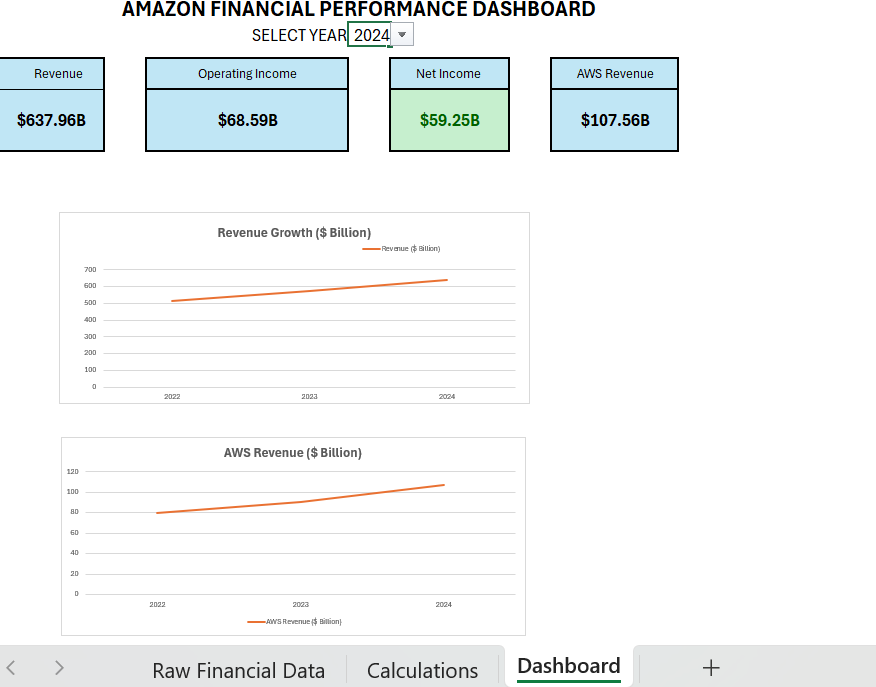

# Amazon Financial Analysis Dashboard

An interactive financial performance dashboard built in Microsoft Excel using publicly available Amazon financial data.

## Project Overview

This project analyzes Amazon's financial performance across multiple years using an interactive Excel dashboard.

The dashboard focuses on four key financial metrics:

- Revenue
- Operating Income
- Net Income
- AWS Revenue

##  Dashboard Features

- Interactive year selection using a dropdown
- Dynamic KPI cards
- Revenue growth visualization
- AWS revenue trend analysis
- Year-over-year financial comparison
- Separate raw data and calculation sheets

##  Tools & Techniques

- Microsoft Excel
- XLOOKUP
- Data Validation
- KPI Cards
- Data Visualization
- Financial Analysis
- Year-over-Year Growth Analysis

##  2024 Snapshot

| Metric | 2024 |
|---|---:|
| Revenue | $637.96B |
| Operating Income | $68.59B |
| Net Income | $59.25B |
| AWS Revenue | $107.56B |

##  Objective

The objective of this project was to transform publicly available financial data into an interactive dashboard that makes Amazon's financial performance easier to analyze and compare across years.

##  Project Structure

- `Amazon Financial Analysis.xlsx` — Complete Excel dashboard and supporting data
- `amazon-dashboard.png` — Dashboard preview

##  Author

**Swetha Sureshkumar**
